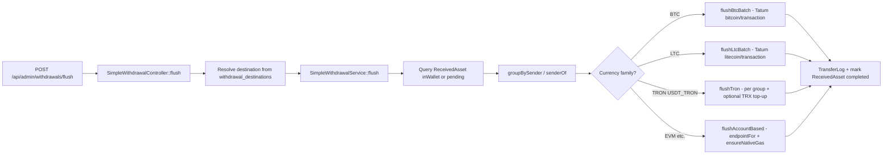

# Admin flush (treasury sweep) — complete guide

This document describes **flush**: moving funds from **custodial deposit addresses** into **fixed treasury addresses** by sweeping `received_assets` rows. It is **not** the same as a user “withdraw to my wallet” flow.

---

## Table of contents

1. [What flush does](#what-flush-does)
2. [HTTP API](#http-api)
3. [Authentication and routing note](#authentication-and-routing-note)
4. [Configuration](#configuration)
5. [End-to-end flow](#end-to-end-flow)
6. [Behavior by asset family](#behavior-by-asset-family)
7. [Persistence](#persistence)
8. [Controller source](#controller-source)
9. [Service entrypoint](#service-entrypoint)
10. [Related files](#related-files)

---

## What flush does

| Aspect | Detail |
|--------|--------|
| **Data source** | `ReceivedAsset` rows for the given `currency` with status `inWallet` or `pending`. |
| **Destination** | **Not** supplied by the client. Taken from `config('withdrawal_destinations')[$currency]` (treasury / hot wallet addresses). |
| **Signing** | Uses **private keys stored on `deposit_addresses`** (decrypted via Laravel `Crypt`) for each deposit address that holds the funds. |
| **Broadcast** | Tatum API (`config('tatum')` — `api_key`, `base_url`, chain-specific options). |
| **Optional safety** | `dry_run: true` builds a **plan** only (no broadcast). `limit` caps how many rows are loaded per request. |

Flush is **custody consolidation**: many small inbound deposits → one (or few) outbound transfers to treasury.

---

## HTTP API

**Method and path (Laravel `routes/api.php`, global `/api` prefix):**

| Item | Value |
|------|--------|
| Method | `POST` |
| Path | `/api/admin/withdrawals/flush` |

**Headers**

- `Authorization: Bearer <sanctum_token>`
- `Accept: application/json`
- `Content-Type: application/json`

**JSON body**

| Field | Required | Type | Description |
|-------|----------|------|-------------|
| `currency` | Yes | string | e.g. `BTC`, `LTC`, `ETH`, `TRON`, `USDT_TRON`, `BSC`, `USDT_BSC`, `MATIC`, `USDT_POLYGON`, … (must match keys supported by the service and config). |
| `limit` | No | int | `1`–`5000`. Max rows to load; `0` or omitted = no SQL limit. |
| `dry_run` | No | bool | `true` = compute groups and return `plan` without broadcasting. |

**Successful responses**

- HTTP **200** when `success` is `true` (including “no items” and dry runs).
- Response body is the array returned from `SimpleWithdrawalService::flush()` (JSON), typically including:
  - `success`, `message`
  - optional `plan`, `txId` / `txIds`, `count`, `tatum` (on errors)

**Error responses**

- **422** — validation failure (`VALIDATION_ERROR`, `errors` object).
- **400** — no entry in `withdrawal_destinations` for that `currency`.
- **500** — flush failed (`success: false` from service).

**Example: dry run**

```http
POST /api/admin/withdrawals/flush HTTP/1.1
Authorization: Bearer <token>
Content-Type: application/json

{
  "currency": "BTC",
  "limit": 100,
  "dry_run": true
}
```

**Example: live sweep (use only after verifying `plan`)**

```http
POST /api/admin/withdrawals/flush HTTP/1.1
Authorization: Bearer <token>
Content-Type: application/json

{
  "currency": "USDT_TRON",
  "limit": 50,
  "dry_run": false
}
```

---

## Authentication and routing note

In the current codebase, this route is registered **inside** `Route::middleware('auth:sanctum')` but **outside** the `Route::prefix('admin')->middleware(['admin'])` group.

That means **any user with a valid Sanctum token** can hit this endpoint unless you add another layer (e.g. move the route under `admin` middleware, or gate in the controller). Treat this as a **deployment/security checklist** item when exposing the API.

---

## Configuration

**Treasury addresses per currency** — `config/withdrawal_destinations.php`:

```php
<?php

return [
    'BTC'        => 'bc1q...',   // example: bech32 treasury
    'ETH'        => '0x...',
    'TRON'       => 'T...',
    'USDT_TRON'  => 'T...',
    'SOL'        => '...',
    'LTC'        => 'ltc1...',
    'BSC'        => '0x...',
    'USDT_BSC'   => '0x...',
    'USDT'       => '0x...',
    'USDC'       => '0x...',
];
```

**Tatum** — env / `config/tatum.php` (typical keys):

- `TATUM_API_KEY` / `tatum.api_key`
- `TATUM_BASE_URL` / `tatum.base_url` (default often `https://api.tatum.io/v3`)
- BTC fee rate: `tatum.btc.fee_satvb`
- TRON: `tatum.tron.usdt_contract`, `tatum.tron.default_fee_limit_sun`, `tatum.tron.gas_topup_min_trx`, `tatum.tron.gas_topup_amount_trx`

---

## End-to-end flow



**Sender resolution (`senderOf`)** — only addresses you control:

1. Tries columns on the row: `transfer_address`, `deposit_address`, `address`, `to_address`, `from_address`.
2. Matches `DepositAddress` in DB (case-insensitive).
3. Fallback: `account_id` → `VirtualAccount` → `DepositAddress`.
4. Fallback: `user_id` + chain hints from `chainHintsForCurrency`.

Rows without a resolvable deposit address are skipped when grouping.

---

## Behavior by asset family

### BTC

- **Single batch** UTXO transaction: all inputs from grouped senders, one sweep output to `destination`.
- Fee: vbyte estimate × `config('tatum.btc.fee_satvb', 12)` sat/vB.
- Additional **platform cut** on BTC sweep: `35%` of total input is subtracted (see `flushBtcBatch` in `SimpleWithdrawalService.php` — variable name/comments may say “25%” in places; the code uses `0.35`).
- Tatum: `POST {base}/bitcoin/transaction`.

### LTC

- Batch similar to BTC: `POST {base}/litecoin/transaction`.
- Fixed fee heuristic (`minFee` + per-input bump).

### TRON (`TRON`, `USDT_TRON`)

- **Per sender group** (not one batch tx for all).
- `USDT_TRON`: TRC-20 via `/tron/trc20/transaction`; may **top up TRX** from `MasterWallet` blockchain `TRON` if balance below minimum.
- Native TRX: `/tron/transaction`.

### Account-based / EVM (`flushAccountBased`)

- `endpointFor($currency)` maps currency → Tatum path (`/ethereum/transaction`, `/bsc/transaction`, `/polygon/transaction`, `/polygon/erc20/transaction`, etc.) and optional `contractAddress` for tokens.
- **Per sender** transaction.
- `ensureNativeGas` may send ETH/BNB/MATIC from `MasterWallet` to the deposit address if native balance is below a chain-specific minimum.

### Unsupported currency

- If `endpointFor` returns `null` and the currency is not BTC/LTC/TRON/USDT_TRON, flush returns `success: false` with an unsupported message.

---

## Persistence

On successful broadcast (not dry run):

1. **`TransferLog`** — one row per batch (BTC/LTC) or per sender group (TRON/EVM).
2. **`ReceivedAsset`** — each flushed row: `status = completed`, `transfered_tx` set, `address_to_send` = treasury destination, etc.

---

## Controller source

File: `app/Http/Controllers/SimpleWithdrawalController.php`

```php
<?php

namespace App\Http\Controllers;

use App\Services\SimpleWithdrawalService;
use Illuminate\Http\Request;
use Illuminate\Support\Facades\Validator;

class SimpleWithdrawalController extends Controller
{
    /**
     * Body:
     *  - currency (string)        e.g., BTC | TRX | USDT_TRON | ETH | USDT_ETH | BNB | USDT_BSC | MATIC | USDT_POLYGON
     *  - destination (string)     recipient address
     *  - limit? (int)             cap rows processed this call
     *  - dry_run? (bool)          don't broadcast, just return plan
     */
     public function flush(Request $req, SimpleWithdrawalService $svc)
    {
        $v = Validator::make($req->all(), [
            'currency' => ['required','string','max:32'],
            'limit'    => ['nullable','integer','min:1','max:5000'],
            'dry_run'  => ['nullable','boolean'],
        ]);

        if ($v->fails()) {
            return response()->json([
                'success' => false,
                'code'    => 'VALIDATION_ERROR',
                'errors'  => $v->errors(),
            ], 422);
        }

        $data = $v->validated();
        $currency = strtoupper($data['currency']);

        // Force destination from config
        $destinations = config('withdrawal_destinations');
        if (!isset($destinations[$currency])) {
            return response()->json([
                'success' => false,
                'message' => "No safe destination configured for {$currency}.",
            ], 400);
        }
        $destination = $destinations[$currency];

        $res = $svc->flush(
            $currency,
            $destination,
            (int)($data['limit'] ?? 0),
            (bool)($data['dry_run'] ?? false),
        );

        return response()->json($res, $res['success'] ? 200 : 500);
    }
}
```

> Note: The docblock still mentions `destination` in the body; the implementation **ignores** client-supplied destinations and always uses `withdrawal_destinations`.

---

## Service entrypoint

File: `app/Services/SimpleWithdrawalService.php` (opening of `flush` and branch dispatch)

```php
public function flush(string $currency, string $destination, int $limit = 0, bool $dryRun = false): array
{
    $q = ReceivedAsset::query()
        ->where('currency', $currency)
        ->whereIn('status', ['inWallet', 'pending'])
        ->orderBy('id');

    if ($limit > 0) $q->limit($limit);

    $items = $q->get();
    if ($items->isEmpty()) {
        return ['success' => true, 'message' => "No pending {$currency} items.", 'count' => 0];
    }

    $groups = $this->groupBySender($items);
    if (empty($groups)) {
        return ['success' => false, 'message' => 'No valid items found (missing sender/amount).'];
    }

    try {
        if ($currency === 'BTC') {
            return $this->flushBtcBatch($groups, $items, $destination, $dryRun);
        }
        if ($currency === 'LTC') {
            return $this->flushLtcBatch($groups, $items, $destination, $dryRun);
        }
        if (in_array($currency, ['TRON', 'USDT_TRON'], true)) {
            return $this->flushTron($currency, $groups, $items, $destination, $dryRun);
        }

        return $this->flushAccountBased($currency, $groups, $items, $destination, $dryRun);
    } catch (\Throwable $e) {
        Log::error('Flush fatal', ['currency' => $currency, 'err' => $e->getMessage()]);
        return ['success' => false, 'message' => $e->getMessage()];
    }
}
```

The rest of the implementation (`flushBtcBatch`, `flushLtcBatch`, `flushTron`, `flushAccountBased`, `endpointFor`, `ensureNativeGas`, key decryption, etc.) lives in the same file.

---

## Related files

| File | Role |
|------|------|
| `routes/api.php` | Registers `POST /admin/withdrawals/flush` → `SimpleWithdrawalController@flush`. |
| `app/Http/Controllers/SimpleWithdrawalController.php` | Validates input, resolves treasury address, calls service. |
| `app/Services/SimpleWithdrawalService.php` | Core flush logic and Tatum integration. |
| `config/withdrawal_destinations.php` | Treasury addresses per currency. |
| `config/tatum.php` / `.env` | Tatum credentials and chain tuning. |
| `app/Models/ReceivedAsset.php` | Model for rows being swept. |
| `app/Models/DepositAddress.php` | Deposit addresses and encrypted keys. |
| `app/Models/TransferLog.php` | On-chain flush audit log. |
| `app/Models/MasterWallet.php` | Used for TRX top-up and EVM gas top-up. |

For comparison with **user-initiated external sends** (master wallet → user address), see `docs/EXTERNAL_SEND_AND_FLUSH.md`.
